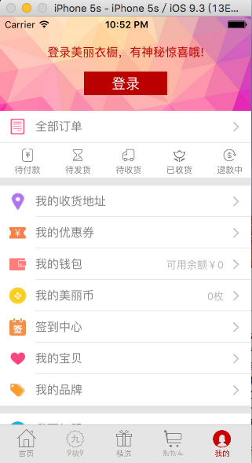

MeiLiYiChu（仿美丽衣橱）
  
************

  &nbap&nbsp根据美丽衣橱的项目来仿写的一个项目，实现了商品的展示，刷新，排版，列表选项等功能，分为首页，9块9界面，精选界面，购物车界面，和我的界面，其中购物车界面和我的两个界面是一级界面。（没有支付功能）。<br>
  希望和大家共同学习探讨，共同进步。Y(^_^)Y

============

###<div align = center>Autor:Haven</div>
###<div align = center>E-mail:HavenMailBox@163.com(欢迎骚扰)</div>

============

##目录

* [GIF图片](#GIF图片)
* [首页](#首页)
* [9块9界面](#9块9界面)
* [精选界面](#精选界面)
* [我的界面](#我的界面)

============

GIF图片
------------


首页
------------


9块9界面
------------


精选界面
------------


我的界面
------------


     
    小图片展,设置图片的大小。 
```html

```
<br>


